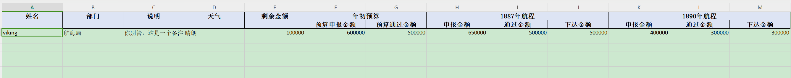

# 基于xlsx-js-style实现纯前端导出，实现多级表头、合并单元格、单元格样式

```
import * as XLSXJS from 'xlsx-js-style'

// 只针对线条项目预算汇总的导出
/*
* @param {String} excelName 文件名
* @param {Array} data 数据
* @param {Array} columns 表头
* @param {Boolean} isChildren 是否有二级表头
*/

// 数据样例
/*
  data = [
    {
      'id': '52e4920caaac11eeb7560050569c4cb7',
      'name': 'viking',
      'department': '航海局',
      'description': '你别管，这是一个备注',
      'weather': '晴朗',
      'currentYsAmount': 10000000,
      'ysDeclaredAmount': 600000,
      'ysPassAmount': 500000,
      'aa': 650000,
      'bb': 500000,
      'cc': 500000,
      'dd': 400000,
      'ee': 300000,
      'ff': 300000
    }
  ]

  columns = [
    {
      'label': '姓名',
      'prop': 'name',
      'minWidth': 100,
      'fixed': 'left'
    },
    {
      'label': '部门',
      'prop': 'department',
      'minWidth': 140,
      'fixed': 'left'
    },
    {
      'label': '说明',
      'prop': 'description',
      'minWidth': 180
    },
    {
      'label': '天气',
      'prop': 'weather',
      'minWidth': 180
    },
    {
      'label': '剩余金额',
      'prop': 'currentYsAmount',
      'minWidth': 100
    },
    {
      'label': '年初预算',
      'children': [
        {
          'label': '预算申报金额',
          'prop': 'ysDeclaredAmount',
          'minWidth': 120
        },
        {
          'label': '预算通过金额',
          'prop': 'ysPassAmount',
          'minWidth': 120
        }
      ]
    },
    {
      'label': '1887年航程',
      'children': [
        {
          'label': '申报金额',
          'prop': 'aa',
          'minWidth': 120
        },
        {
          'label': '通过金额',
          'prop': 'bb',
          'minWidth': 120
        },
        {
          'label': '下达金额',
          'prop': 'cc',
          'minWidth': 120
        }
      ]
    },
    {
      'label': '1890年航程',
      'children': [
        {
          'label': '申报金额',
          'prop': 'dd',
          'minWidth': 120
        },
        {
          'label': '通过金额',
          'prop': 'ee',
          'minWidth': 120
        },
        {
          'label': '下达金额',
          'prop': 'ff',
          'minWidth': 120
        }
      ]
    }
  ]

*/
export function newExportExcel(excelName, data, columns, isChildren = false) {
  const newData = []
  const keys = getParams(columns, [], 'prop')
  // 获取数据
  data.forEach((item) => {
    const row = []
    for (let key of keys) {
      row.push(item[key])
    }
    newData.push(row)
  })

  const headers = getParams(columns, [], 'label')

  let finalHeader = headers

  if (isChildren) {
    let secondHeader = []
    headers.forEach((item) => {
      if (item instanceof Array) {
        secondHeader.pop()
        secondHeader = [...secondHeader, ...item]
      } else if (item !== '') {
        secondHeader.push('')
      }
    })
    // 添加表头
    newData.unshift(secondHeader)
    finalHeader = secondHeader
  }
  newData.unshift(headers)
  const workbook = XLSXJS.utils.book_new()
  const worksheet = XLSXJS.utils.json_to_sheet(newData, { skipHeader: true })

  // 合并单元格
  const merges = [{ s: { r: 0, c: 5 }, e: { r: 0, c: 6 } }]
  let colIndex = 7
  columns.forEach((item) => {
    if (item.children && item.label !== '年初预算下达') {
      merges.push({ s: { r: 0, c: colIndex }, e: { r: 0, c: colIndex + 2 } })
      colIndex = colIndex + 3
    }
  })
  worksheet['!merges'] = merges

  // 设置列宽
  const columnsWidth = finalHeader.map(() => { return { wpx: 120 } })
  worksheet['!cols'] = columnsWidth

  // 设置表头样式
  const commonStyle = {
    font: {
      bold: true,
      sz: 12,
      name: '宋体'
    },
    fill: {
      fgColor: { rgb: 'dde4f4' }
    },
    alignment: {
      horizontal: 'center',
      vertical: 'center'
    },
    border: {
      top: {
        style: 'thin',
        color: '#000000'
      },
      right: {
        style: 'thin',
        color: '#000000'
      },
      bottom: {
        style: 'thin',
        color: '#000000'
      },
      left: {
        style: 'thin',
        color: '#000000'
      }
    }
  }
  const length = finalHeader.length
  finalHeader.forEach((item, index) => {
    const cell = indexToLetters(index, length)
    const cell1 = cell + 1
    const cell2 = cell + 2
    if (worksheet[cell1]) worksheet[cell1].s = commonStyle
    if (worksheet[cell2]) worksheet[cell2].s = commonStyle
  })
  XLSXJS.utils.book_append_sheet(workbook, worksheet, 'Sheet1')
  XLSXJS.writeFile(workbook, `${excelName}.xlsx`)
}

function getParams(columns, headers = [], type) {
  columns.forEach((item) => {
    if (item.children) {
      // 父表头
      headers.push(item[type])
      // 子表头
      let list = getParams(item.children, [], type)
      if (type === 'label') {
        headers.push(list)
        for (let i = 0; i < list.length - 2; i++) {
          // 存在子类，则父表头存在合并单元格，需要提前占位用于合并
          headers.push('')
        }
      } else {
        // 获取字段名
        headers = [...headers, ...list]
        // 去除 undefined
        headers = headers.filter((item) => item)
      }
    } else {
      headers.push(item[type])
    }
  })
  return headers
}

function indexToLetters(i, length) {
  if (i >= 0 && i <= length) {
    return String.fromCharCode(65 + i)
  } else {
    return undefined
  }
}
```

#### 效果
